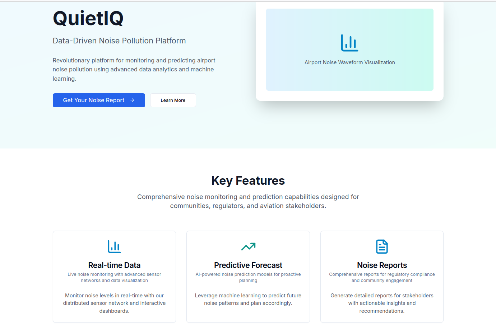

# QuietIQ Frontend Mockup

A **static**, production-ready mockup of the QuietIQ capstone project report. This repository contains the entire frontend scaffold for the “QuietIQ” noise-pollution platform, built in React + Next.js with Tailwind CSS, designed for export to GitHub Pages. All data interactions are client-side or mocked; the real backend integrations will come later.

## Table of Contents

- [Demo](#demo)  
- [Features](#features)  
- [Tech Stack](#tech-stack)  
- [Getting Started](#getting-started)  
  - [Prerequisites](#prerequisites)  
  - [Installation](#installation)  
  - [Development](#development)  
  - [Building & Exporting](#building--exporting)  
- [Project Structure](#project-structure)  
- [Usage](#usage)  
- [Contributing](#contributing)  
- [License](#license)  
- [Acknowledgments](#acknowledgments)

## Demo

  
_View of the static hero section with “Get Your Noise Report” modal._

You can preview the live, exported site here:  
https://y8o.github.io/quiet.iq/

## Features

- **Static, client-side only**: Built for `next export` → GitHub Pages.  
- **Responsive design**: Mobile-friendly navbar, footer, and layouts.  
- **Core pages**:  
  - Home with hero, feature cards, and report generator modal  
  - Problem overview with charts and accordions  
  - Solution section with interactive map mockups & business model canvas  
  - Ecosystem mapping with hover tooltips  
  - Prototype carousel of Appendix A screenshots  
  - Roadmap timeline, Risks & Opportunities  
  - Team roster & mentor details  
  - Contact form writing to `localStorage` and mock PDF download  
- **Mini-apps**:  
  - Noise Score Calculator widget  
  - Date-picker forecast chart (mocked with Chart.js)  
- **SEO & Meta**: Title, description, Open Graph tags  
- **Dark/Light mode** toggle  

## Tech Stack

- [Next.js](https://nextjs.org/) (React framework)  
- [Tailwind CSS](https://tailwindcss.com/)  
- [Chart.js](https://www.chartjs.org/) for static graphs  
- [Leaflet](https://leafletjs.com/) (with mocked GeoJSON)  
- ES6+, npm, GitHub Pages deployment  

## Getting Started

### Prerequisites

- Node.js ≥ 16.x  
- npm ≥ 8.x  
- Git  

### Installation

1. Clone the repo:  
   ```bash
   git clone https://github.com/YOUR_USERNAME/quietiq-frontend.git
   cd quietiq-frontend
   ```
2. Install dependencies:  
   ```bash
   npm install
   ```

### Development

Run a local dev server with hot reload:

```bash
npm run dev
```

Open [http://localhost:3000](http://localhost:3000).

### Building & Exporting

To generate a fully static site:

```bash
npm run build
npm run export
```

The exported files will appear in the `out/` directory, ready to be pushed to `gh-pages` or served from any static host.

## Project Structure

```
/
├── components/       # Reusable UI components: Button, Card, Accordion, etc.
├── pages/            # Next.js pages (exported as .html)
│   ├── index.js
│   ├── problem.js
│   ├── solution.js
│   └── …
├── public/
│   ├── screenshots/  # Static images for demo
│   ├── report.pdf    # Full Capstone PDF
│   └── …
├── styles/           # Tailwind config + globals
├── next.config.js    # next export settings
├── tailwind.config.js
└── package.json
```

## Usage

- **Generate a mock report**: Click “Get Your Noise Report,” enter an address + email → download a placeholder PDF.  
- **Test widgets**:  
  - Enter decibel value to see the health-impact badge.  
  - Select a forecast date in the date-picker to view a mocked hourly noise chart.

## Contributing

1. Fork the repo  
2. Create your feature branch (`git checkout -b feature/name`)  
3. Commit your changes (`git commit -m "feat: add X"`)  
4. Push to the branch (`git push origin feature/name`)  
5. Open a Pull Request

Please adhere to the existing code style (ESLint + Prettier).

## License

This project is licensed under the MIT License. See [LICENSE](LICENSE) for details.

## Acknowledgments

- Inspired by my FSE 570/TEM 598 Technology Innovation Lab Capstone at ASU  
- Thanks to Honeywell Aerospace for the problem statement  
- React Day Picker, Chart.js, Leaflet, and the Next.js & Tailwind communities for their great tools.
